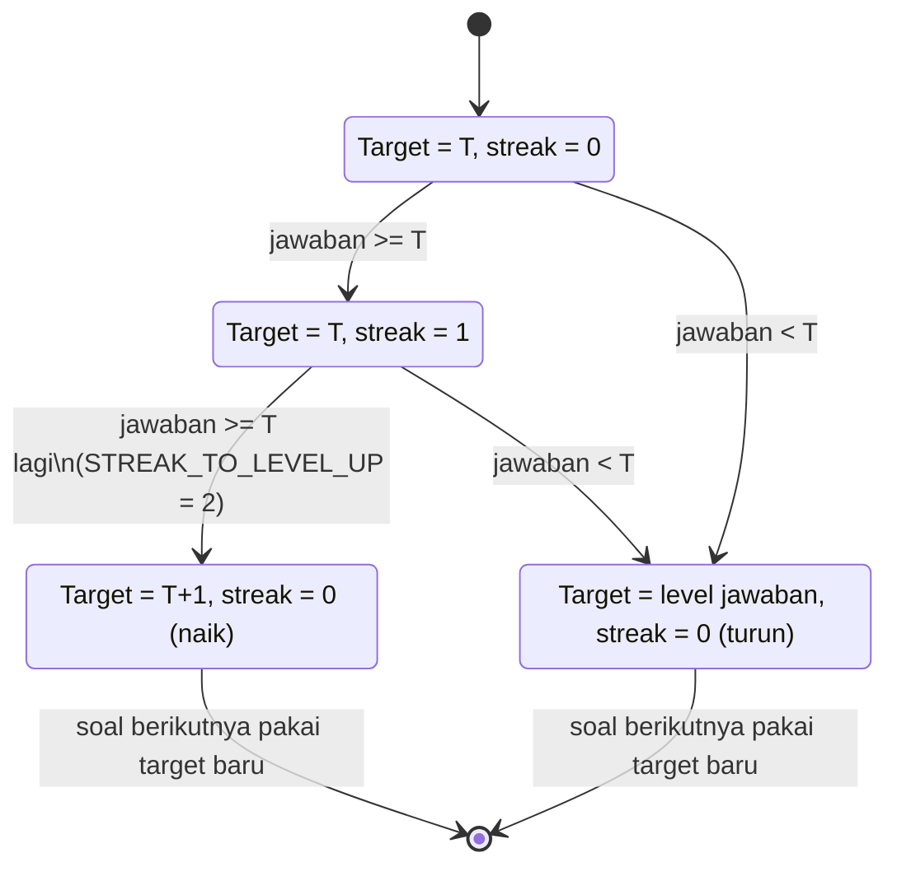
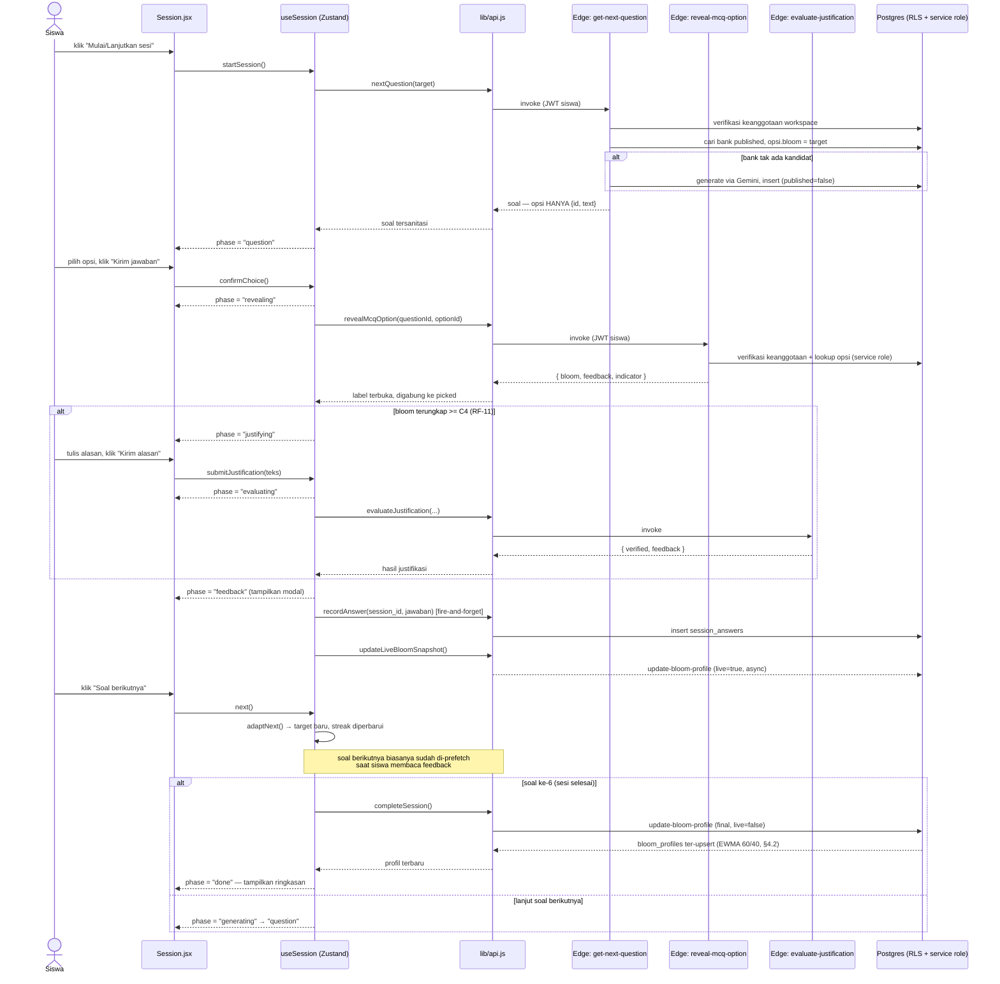
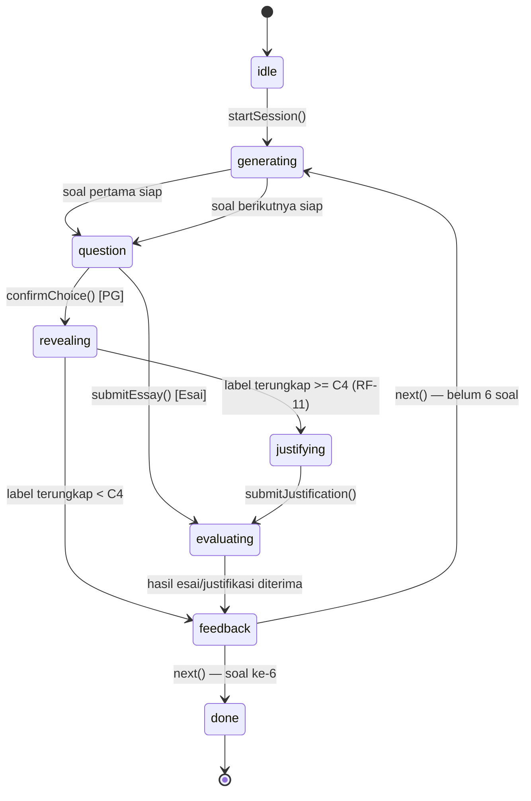

# Arsitektur VSmartClass

Dokumen ini melengkapi `README.md` dengan detail perancangan: skema data,
batas kepercayaan (trust boundary) antara klien dan server, serta alur mesin
adaptif. Ditulis sebagai bagian dari Fase 2 (lihat `AUDIT.md` untuk konteks
audit awal dan `CHANGES.md` untuk ringkasan perubahan per fase).

## 1. Ringkasan tumpukan teknologi

```
Klien (React 19 + Vite + Zustand + React Query)
   │  HTTPS (Supabase JS client, JWT per-user)
   ▼
Supabase
   ├─ Postgres + Row-Level Security  → data milik sendiri/workspace saja
   ├─ Auth                            → JWT, trigger auto-create profil
   ├─ Realtime                        → heatmap/stat guru live
   ├─ Storage (bucket project-files)  → laporan proyek siswa
   └─ Edge Functions (Deno, service role — bypass RLS, validasi manual)
         ├─ generate-questions        (guru: buat soal eksplisit)
         ├─ get-next-question         (siswa: soal sesi adaptif, tersanitasi)
         ├─ reveal-mcq-option         (siswa: buka label opsi setelah dijawab)
         ├─ evaluate-essay            (nilai esai → level Bloom + feedback)
         ├─ evaluate-justification    (RF-11: nilai alasan opsi C4+)
         ├─ update-bloom-profile      (EWMA 60/40 → bloom_profiles)
         └─ get-recommendations       (rekomendasi personal + VARK)
              │
              ▼
        Google Gemini 2.5 Flash (GEMINI_API_KEY — HANYA di secrets Edge Function)
```

Mode demo (tanpa `VITE_SUPABASE_URL`/`VITE_SUPABASE_ANON_KEY`) meniru seluruh
alur di atas secara lokal di `src/lib/demo.js` + `src/lib/api.js`, termasuk
sanitasi opsi & simulasi latensi "server", supaya kode `stores/session.js`
sama persis di kedua mode — lihat §4.

## 2. Batas kepercayaan (trust boundary)

Prinsip inti sejak Fase 2: **klien tidak pernah memegang data yang bisa
dipakai untuk "menyontek" sebelum menjawab.** Konkretnya untuk label Bloom
per-opsi Pilihan Ganda (lihat `AUDIT.md` §2.2 — proposal menyebut ini sebagai
batasan yang harus ditutup):

| Data | Sebelum Fase 2 | Sejak Fase 2 |
|---|---|---|
| `questions.options[].bloom/feedback/indicator` | Terkirim penuh ke siswa begitu soal `published` | Hanya `{id, text}` yang terkirim (`get-next-question`); label sesungguhnya baru dibuka `reveal-mcq-option` **setelah** siswa mengklik "Kirim jawaban", dan hanya untuk opsi yang dipilih |
| Pemilihan kandidat soal sesuai target level | Difilter di klien (`option.bloom === target`) — berarti klien harus lebih dulu punya seluruh label | Difilter di server (`get-next-question`, service role) |
| Akses baca tabel `questions` (semua kolom) | `created_by = auth.uid() OR (published AND is_member(workspace))` — siswa anggota kelas bisa `select('*')` langsung | `is_guru_of(workspace_id)` saja — siswa tidak lagi punya akses baca langsung ke tabel ini sama sekali |

Konsekuensinya, ada **dua jalur baca soal** yang sengaja dipisah menurut peran:

- **Guru** (`src/lib/api.js#getQuestions`) → tabel `questions` langsung,
  kolom lengkap. Guru memang harus melihat kunci jawaban untuk meninjau/
  mengedit soal sebelum publish.
- **Siswa** (`src/lib/api.js#getPublicQuestions`, RPC
  `get_published_questions`) → opsi PG tersanitasi, dipakai halaman daftar
  tugas (Beranda/Tugas/Proyek) yang cuma perlu tahu topik & tipe soal.
- **Sesi adaptif siswa** (`nextQuestion` → `get-next-question`,
  `revealMcqOption` → `reveal-mcq-option`) → jalur khusus karena perlu
  memilih kandidat berdasar label Bloom (harus di server) dan mengungkap
  label satu opsi setelah dijawab.

**Keterbatasan yang diketahui (residual, didokumentasikan agar tidak
overclaim):** `reveal-mcq-option` menutup celah *kerahasiaan* (opsi tak
terlihat sebelum dijawab), tapi penulisan baris `session_answers` masih
dilakukan klien (RLS hanya memvalidasi kepemilikan sesi, bukan bahwa nilai
`bloom_chosen` konsisten dengan opsi yang benar-benar diungkap). Mengunci
*integritas* penuh — memaksa server jadi satu-satunya penulis
`session_answers` — adalah perbaikan lebih dalam yang belum termasuk cakupan
fase ini.

`GEMINI_API_KEY` hanya pernah dibaca lewat `Deno.env.get()` di dalam Edge
Function; tidak ada referensi di kode klien maupun `.env` yang dibundel Vite.

## 3. Skema data (ERD)

```mermaid
erDiagram
  PROFILES ||--o{ WORKSPACES : "membuat (created_by)"
  PROFILES ||--o{ WORKSPACE_MEMBERS : "menjadi anggota"
  WORKSPACES ||--o{ WORKSPACE_MEMBERS : memiliki
  WORKSPACES ||--o{ QUESTIONS : memiliki
  WORKSPACES ||--o{ SESSIONS : memiliki
  WORKSPACES ||--o{ BLOOM_PROFILES : memiliki
  WORKSPACES ||--o{ PROJECT_SUBMISSIONS : memiliki
  PROFILES ||--o{ QUESTIONS : "created_by"
  PROFILES ||--o{ SESSIONS : "user_id"
  PROFILES ||--o{ BLOOM_PROFILES : "user_id"
  PROFILES ||--o{ PROJECT_SUBMISSIONS : "user_id"
  PROFILES ||--o{ AI_USAGE : "user_id"
  QUESTIONS ||--o{ SESSION_ANSWERS : dijawab
  SESSIONS ||--o{ SESSION_ANSWERS : berisi

  PROFILES {
    uuid id PK
    text full_name
    text role "guru | siswa"
    text vark_style "V/A/R/K, opsional"
  }
  WORKSPACES {
    uuid id PK
    text name
    text join_code UK
    uuid created_by FK
  }
  WORKSPACE_MEMBERS {
    uuid workspace_id PK_FK
    uuid user_id PK_FK
    text role "guru | siswa"
  }
  QUESTIONS {
    uuid id PK
    uuid workspace_id FK
    uuid created_by FK
    text type "mcq | essay"
    text_array bloom_target
    jsonb options "PG: [{id,text,bloom,indicator,feedback}] — sensitif, lihat §2"
    jsonb rubric "Esai: [{bloom,desc}]"
    boolean published
  }
  SESSIONS {
    uuid id PK
    uuid workspace_id FK
    uuid user_id FK
    text topic
    int bloom_level "modus level sesi"
    timestamptz completed_at
  }
  SESSION_ANSWERS {
    uuid id PK
    uuid session_id FK
    uuid question_id FK
    text chosen_option
    text bloom_chosen "hasil reveal / evaluate-essay, bisa diturunkan RF-11"
    text bloom_target
    text justification "RF-11"
    boolean justification_verified
  }
  BLOOM_PROFILES {
    uuid id PK
    uuid user_id FK
    uuid workspace_id FK
    text topic
    int c1
    int c2
    int c3
    int c4
    int c5
    int c6
    int current_level "level tertinggi dgn c_n >= 60"
    int trend
    int session_count
  }
  PROJECT_SUBMISSIONS {
    uuid id PK
    uuid workspace_id FK
    uuid user_id FK
    text topic
    text file_path "Storage: project-files/{ws}/{user}/..."
    numeric score "Modul 6: guru beri nilai"
    timestamptz reviewed_at
  }
  AI_USAGE {
    uuid user_id PK_FK
    timestamptz window_start
    int request_count "rate limiting Gemini, lihat §2"
  }
```

`bloom_profiles` unik per `(user_id, workspace_id, topic)` — inilah yang
membuat pemetaan kognitif **per-topik**, bukan skor tunggal per siswa (sesuai
klaim proposal "pemetaan kognitif").

## 4. Mesin adaptif — dua lapis

### 4.1 Mikro (intra-sesi): consecutive-success streak

Hiperparameter di `src/lib/config.js` (`ADAPTIVE_CONFIG`) — satu sumber
kebenaran untuk klien; Edge Function `update-bloom-profile` menduplikasi
`MASTERY_BLEND_*`/`MASTERY_THRESHOLD` secara manual (Deno tidak bisa impor
`src/`, lihat komentar sinkronisasi di file tsb).



Implementasi murni: `src/lib/bloom.js#adaptNext`, diuji di
`src/lib/__tests__/bloom.test.js`. Contoh konkret (target awal C3):

| # | Jawaban | Streak sebelum | Target berikutnya | Streak sesudah |
|---|---|---|---|---|
| 1 | C3 (=target) | 0 | C3 | 1 |
| 2 | C4 (≥target) | 1 | **C4** (naik) | 0 |
| 3 | C2 (<target) | 0 | **C2** (turun ke level jawaban) | 0 |

RF-11 menambah satu nuansa: bila opsi yang dipilih bernalar ≥ C4 dan
justifikasi tertulis siswa dinilai *tidak* menunjukkan penalaran level itu
(`verified=false`), nilai "jawaban" yang dipakai `adaptNext` — dan yang
tercatat ke `bloom_chosen` — diturunkan satu tingkat dari yang diklaim opsi
(lihat `stores/session.js#next`).

### 4.2 Makro (antar-sesi): EWMA 60/40

Dihitung ulang di `update-bloom-profile` (final, saat sesi selesai) dan versi
"live" (`live:true`, per-jawaban, tanpa increment `session_count`/`trend` —
untuk heatmap guru real-time):

```
evidence_n  = proporsi jawaban sesi ini dengan level ≥ n   (n = 1..6)
new_c_n     = old_c_n × MASTERY_BLEND_OLD_WEIGHT (0.6)
            + evidence_n × 100 × MASTERY_BLEND_NEW_WEIGHT (0.4)
current_level = level n TERTINGGI dengan new_c_n ≥ MASTERY_THRESHOLD (60)
trend         = sign(current_level_baru − current_level_lama)
```

Diuji di `src/lib/__tests__/profile.test.js` (blend 60/40, ambang 60, anti-
lonjakan skor satu sesi bagus, monotonisitas `c_n` terhadap n).

## 5. Sequence diagram — siswa menjawab soal



## 6. State machine — fase sesi (klien)



Implementasi: `src/stores/session.js`. Fase `revealing`/`justifying`/
`evaluating` masing-masing punya indikator loading tersendiri di
`src/pages/siswa/Session.jsx` agar UI tidak terasa membeku saat menunggu
Edge Function.

## 7. Kalibrasi & pre-generation

- **Kalibrasi awal**: sesi pertama per topik (`session_count === 0` di
  `bloom_profiles`) mulai dari target **C3** (tengah skala), bukan C1 —
  mempercepat konvergensi ke level sesungguhnya siswa (`isDiagnostic` di
  `stores/session.js`/`pages/siswa/Session.jsx`).
- **Panjang sesi**: `SESSION_LENGTH = 6` soal (`config.js`).
- **Pre-generation**: `confirmChoice`/`submitJustification`/`submitEssay`
  memicu `_prefetchNext()` di background segera setelah level berikutnya
  diketahui (sebelum siswa selesai membaca feedback), sehingga transisi ke
  soal berikutnya terasa instan (`ADAPT_DELAY_SHORT = 600ms` vs
  `ADAPT_DELAY = 1500ms` bila belum sempat prefetch).
- **Fallback berlapis** (`nextQuestion`): bank soal published bertarget
  sesuai → esai published bertarget sesuai → generate on-the-fly via Gemini
  → generator template lokal (`demoAdaptiveQuestion`) bila Edge Function
  gagal total (jaringan/kuota). Lapis terakhir ini yang juga dipakai mode
  demo, dan tetap melalui sanitasi yang sama sebelum menyentuh state siswa.
- **Rate limiting**: setiap Edge Function yang memanggil Gemini
  (`generate-questions`, `get-next-question`, `evaluate-essay`,
  `evaluate-justification`, `get-recommendations`) membatasi 8 panggilan/
  menit per pengguna lewat tabel `ai_usage` (`_shared/rateLimit.ts`) —
  window tetap, bukan queue terdistribusi, proporsional untuk skala aplikasi
  kompetisi.

## 8. Referensi cepat

| Perlu tahu... | Lihat |
|---|---|
| Status fitur vs klaim proposal, temuan keamanan awal | `AUDIT.md` |
| Ringkasan perubahan tiap fase, coverage, skor a11y | `CHANGES.md` |
| Cara setup Supabase dari nol | `README.md` §"Menjalankan dengan Supabase" + `supabase/setup.sql` |
| Daftar lengkap migrasi bernomor | `supabase/migrations/0001`–`0010` |
| Hiperparameter mesin adaptif | `src/lib/config.js` |
